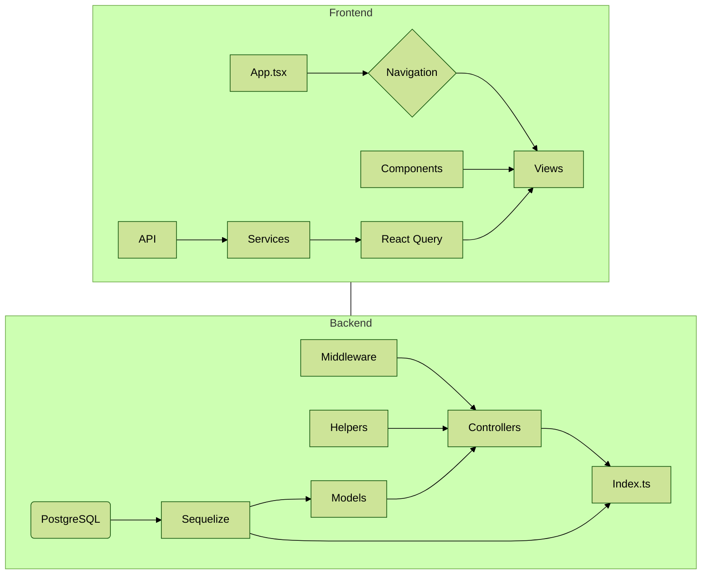

# City Bikes

https://city-bikes.herokuapp.com/

[Demo video](https://www.youtube.com/watch?v=KkoNzc4Cf90)

The goal of this project was to make a React application that allows uploading open source city bike data provided by [HSL](https://www.hsl.fi/en/hsl/open-data) to a clean, sortable, and filterable format. One of the challenges of this project was learning Material UI from scratch, but luckily their extensive online documentation proved to be a valuable source for help. With the help of Material UI, I focused on making the website work smoothly on desktop and mobile using the same code. It's also worth mentioning that all of the code is written in TypeScript using very strict settings for maximal learning experience.

## Deployment

1. Create a new Heroku app with PostgreSQL addon and add a new git repository to the back folder with "git init".
2. Add the Heroku remote to the local repository with "heroku git:remote -a appname".
3. Add environment variables required in back/util/config.ts to your Heroku app.
4. Run the deploy script from backend.

## Technologies

* **TypeScript**
* **React**
* **ExpressJS**
* **PostgreSQL**
* **Sequelize**
* **MUI**
* **React Query**
* **Cypress**

## Structure

